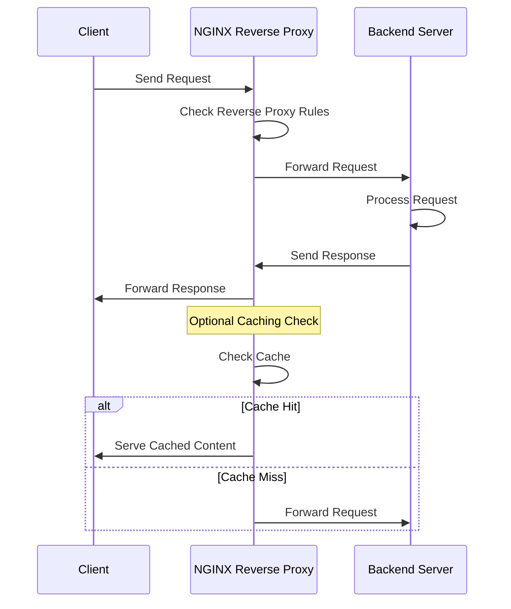

# NGINX Reverse Proxy Setup on Red Hat Enterprise Linux (RHEL)

## Objective

The objective of this project is to set up an NGINX reverse proxy server on Red Hat Enterprise Linux 
(RHEL). This will handle incoming client requests, distribute them to backend servers, and provide load 
balancing and caching.



## Project Overview

1.  **Planning and Preparation**
    
    -   Define requirements and objectives.
    -   Prepare the RHEL environment.
    -   Install NGINX.
2.  **NGINX Installation and Configuration**
    
    -   Install NGINX.
    -   Configure NGINX as a reverse proxy.
    -   Set up load balancing and caching (optional).
3.  **Testing and Validation**
    
    -   Test reverse proxy functionality.
    -   Verify load balancing and caching (if configured).
4.  **Documentation and Conclusion**
    
    -   Document the setup process.
    -   Evaluate benefits, challenges, and performance.

## Step-by-Step Configuration

### 1. Planning and Preparation

-   **Install RHEL**: Ensure RHEL is installed and updated on the server node.
-   **Update System**:

    `sudo yum update -y` 
    

### 2. NGINX Installation and Configuration

#### On NGINX Server Node (e.g., `nginx-proxy`)

-   **Install NGINX**:
    
    `sudo yum install epel-release -y
    sudo yum install nginx -y` 
    
-   **Start and Enable NGINX Service**:

    
    `sudo systemctl start nginx
    sudo systemctl enable nginx` 
    
-   **Configure NGINX as a Reverse Proxy**:
    -   Edit `/etc/nginx/nginx.conf` or create a new configuration file in `/etc/nginx/conf.d/` (e.g., 
`reverse-proxy.conf`):
        
        
        ```
        server {
            listen 80;
            server_name example.com;
        
            location / {
                proxy_pass http://backend_server;
                proxy_set_header Host $host;
                proxy_set_header X-Real-IP $remote_addr;
                proxy_set_header X-Forwarded-For $proxy_add_x_forwarded_for;
                proxy_set_header X-Forwarded-Proto $scheme;
            }
        }` 
        
    -   Replace `backend_server` with the IP or hostname of your backend server.
-   **Reload NGINX Configuration**:
    
    `sudo systemctl reload nginx` 
    

### 3. Testing and Validation

-   **Test Reverse Proxy Functionality**:
    -   Ensure that requests to `http://example.com` are correctly forwarded to the backend server.
    -   Use tools like `curl` or a web browser to verify the reverse proxy setup.
-   **Verify Load Balancing and Caching** (if configured):
    -   Check if requests are distributed among multiple backend servers.
    -   Verify caching by accessing cached content.

### 4. Documentation and Conclusion

-   **Document Configuration**: Record all installation and configuration steps, including NGINX settings 
and backend server details.
-   **Evaluate Benefits**:
    -   **Load Balancing**: Distributes incoming requests across multiple backend servers.
    -   **Caching**: Improves performance by caching frequently requested content.
    -   **SSL Termination**: (Optional) Offloads SSL/TLS encryption from backend servers.
-   **Challenges**:
    -   **Configuration Complexity**: Properly configuring NGINX for reverse proxy, load balancing, and 
caching.
    -   **Security**: Ensuring secure communication between the reverse proxy and backend servers.
